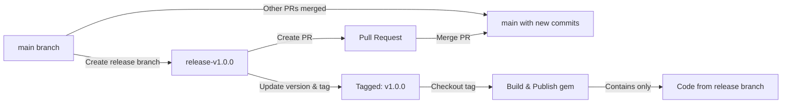
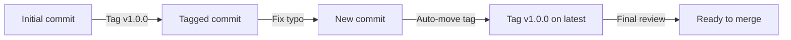

# Releasing

This document describes the release process for Ruby gems used in this project, which is fully automated through GitHub Actions workflows.

## Overview

The release process consists of three automated workflows:

1. **Release Preparation** - Creates a release branch with version updates
2. **Release Validation** - Validates the release branch on PR creation
3. **Release Publish** - Publishes the gem after PR merge

## Prerequisites

Before initiating a release, ensure:

- [ ] All desired features and fixes are merged to `main`
- [ ] CI is passing on `main` branch
- [ ] `CHANGELOG.md` has entries under `## [Unreleased]` section
- [ ] `RUBYGEMS_API_KEY` secret is configured in repository settings

## Release Process

### Step 1: Initiate Release

1. Go to the [Actions tab](../../actions) in the GitHub repository
2. Select "Release Preparation" workflow
3. Click "Run workflow"
4. Enter the version number (e.g., `1.0.0`)
5. Click "Run workflow"

The workflow will automatically:
- Create a new branch `release-v{version}`
- Update `lib/[gem_name]/version.rb` with the new version
- Update `CHANGELOG.md`:
  - Replace `## [Unreleased]` with `## [{version}] - {date}`
  - Add a new `## [Unreleased]` section for future changes
- Create a git tag `v{version}` on the release branch
- Push the branch and tag to GitHub
- Create a Pull Request to `main`

### Step 2: Review and Merge

Once the PR is created, the Release Validation workflow automatically:
- Validates version format (must be `x.y.z`)
- Verifies version consistency between branch name and `version.rb`
- Checks that the git tag doesn't already exist (or can be updated)
- Confirms the version isn't already published on RubyGems
- Verifies `RUBYGEMS_API_KEY` secret is configured
- Validates `CHANGELOG.md` has an entry for this version

**Note**: Quality checks (tests and RuboCop) are handled by the CI workflow to avoid duplication.

**Important**: If you push additional commits to the release PR (e.g., bug fixes, workflow updates, documentation changes):
- The validation workflow automatically moves the release tag to the latest commit
- This ensures the tag always points to the final reviewed code
- No manual intervention required
- All changes will be included in the final release

If all checks pass, merge the PR.

### Step 3: Automatic Publishing

After the PR is merged, the Release Publish workflow automatically:
- Checks out the exact git tag created on the release branch
- Builds the gem from the tagged commit
- Publishes the gem to RubyGems
- Creates a GitHub Release with:
  - Release notes extracted from `CHANGELOG.md`
  - The built gem file as an attachment
- Cleans up the release branch

## Workflow Architecture

### Key Design Decisions

#### Tag-Based Deployment

The release workflow uses a **tag-based deployment strategy** to ensure the released gem contains exactly the code that was reviewed and approved in the release PR, without any subsequent changes from `main`.



#### Automatic Tag Movement

When additional commits are pushed to a release PR, the tag automatically moves to the latest commit:



This ensures:
- The tag always points to the final reviewed code
- No manual tag management required
- The published gem matches exactly what was approved

## Manual Release (Emergency Only)

If automation fails, you can release manually using our tag-based strategy:

```bash
# 1. Create release branch
git checkout -b release-v1.0.0

# 2. Update version
vim lib/[gem_name]/version.rb

# 3. Update CHANGELOG (move content from [Unreleased] to [1.0.0])
vim CHANGELOG.md

# 4. Commit changes and create tag
git add -A
git commit -m ":bookmark: Release v1.0.0"
git tag -a v1.0.0 -m "Release v1.0.0"

# 5. Push release branch and tag
git push origin release-v1.0.0
git push origin v1.0.0

# 6. Create PR and merge after review
gh pr create --title "Release v1.0.0" --body "Release v1.0.0"
# (Review and merge PR)

# 7. Checkout the tag and build gem
git checkout v1.0.0
bundle exec rake build

# 8. Push to RubyGems
gem push pkg/[gem_name]-1.0.0.gem

# 9. Create GitHub release
gh release create v1.0.0 --title "[gem_name] v1.0.0" --generate-notes pkg/[gem_name]-1.0.0.gem
```

## Troubleshooting

### Release Validation Fails

**Version already exists on RubyGems**
- Solution: Increment the version number and try again

**RUBYGEMS_API_KEY not configured**
1. Generate an API key at https://rubygems.org/profile/edit
2. Go to repository Settings → Secrets and variables → Actions
3. Add new secret: `RUBYGEMS_API_KEY` with your API key

**Tests or RuboCop failing**
- These are checked by the CI workflow, not in release validation
- Fix the issues on the release branch or `main` as appropriate
- Release validation focuses on version consistency and format

### Release Publish Fails

**Tag not found**
- The release preparation workflow may have failed to create the tag
- Check if the tag exists: `git tag | grep v1.0.0`
- If missing, the release validation workflow will recreate it on PR updates
- For manual fix: create tag on release branch with `git tag -a v1.0.0 -m "Release v1.0.0"`

**Gem push fails**
- Verify RubyGems API key is valid
- Check if you have push permissions for the gem
- Ensure the version doesn't already exist on RubyGems

## Version Numbering

Follow [Semantic Versioning](https://semver.org/):

- **MAJOR** version for incompatible API changes
- **MINOR** version for backwards-compatible functionality additions  
- **PATCH** version for backwards-compatible bug fixes

Examples:
- `0.1.0` → `0.1.1`: Bug fixes only
- `0.1.1` → `0.2.0`: New features added
- `0.2.0` → `1.0.0`: Breaking changes or stable release

## Workflow Files

The release automation is implemented in:

- `.github/workflows/release-preparation.yml` - Creates release branch and PR
- `.github/workflows/release-validation.yml` - Validates release PR
- `.github/workflows/release-publish.yml` - Publishes gem after merge

## Security Notes

- The `RUBYGEMS_API_KEY` secret is only accessible to workflows running on the default branch
- Release branches are automatically deleted after successful release
- All releases are tagged for audit trail and rollback capability